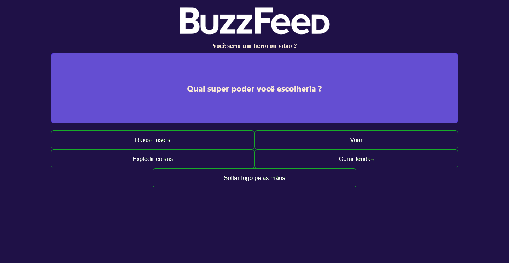
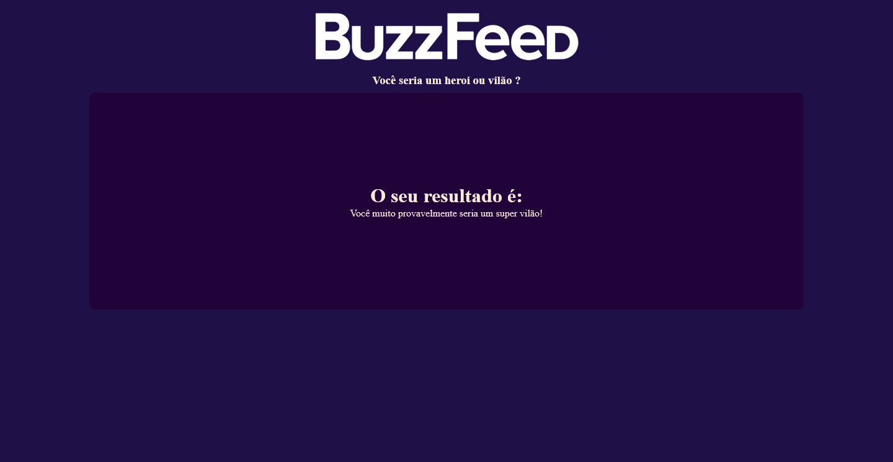

# 💻 Simples Clone do Buzzfeed

## 📖 Descrição

Projeto desenvolvido com o framework **Angular**, utilizando *HTML*, *CSS* e *Typescript*. Esse projeto foi desenvolvido durante o bootcamp da **NTT Data** na plataforma da **Digital Innovation One**.

O projeto consiste em um set de perguntas e respostas, onde fornecerá um resultado baseado nas respostas que o usuário escolheu. Por exemplo, para saber se o usuário seria um herói ou vilão na vida real, precisa escolher as opções que mais se adequam às suas preferências.

As perguntas e respostas são retiradas de um arquivo `json`, onde o conteúdo é trabalhado e passado dinamicamente ao componente das opções.

Revisei diversos conteúdos relacionados ao framework, como as diretivas como `ngFor` e `ngIf`, organização dos componentes e como podemos montar diversas maneiras para atingir o mesmo objetivo.

## 🔨 Ferramentas e Tecnologias

  
  
  
  
  
  

## 🖼️ Imagem do site

**Pergunta e Opções**

**Resultado Final**

## 📌 Mais informações

Projeto desenvolvido durante o bootcamp da NTT Data, na plataforma da Digital Innovation One (DIO), durante as aulas do instrutor Felipe Aguiar.

## 🔗 Links

* [🔍 DIO](https://www.dio.me/)